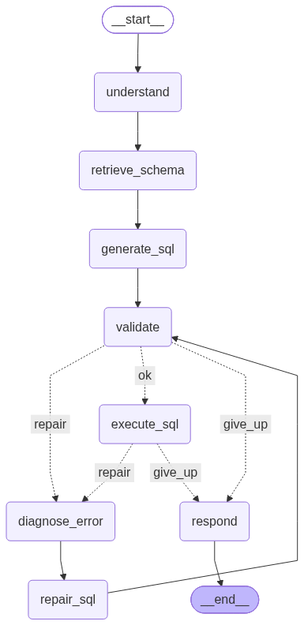

# Self-Healing Text-to-SQL Assistant

## Description

Ask a question in plain English and get back SQL, the rows it returns, and a short answer. If the generated SQL fails validation or errors out in Postgres, the assistant reads the error, repairs the query, and tries again, up to three times.

I built this to learn the stack behind LLM agents by building one. Most text-to-SQL demos stop at "LLM writes a query". The harder part is what happens when that query is wrong: a table name that doesn't exist, a column on the wrong table, or a statement that should never run. This project handles those cases in code rather than hoping the prompt covers them.

What I learned building it:

- Python packaging: `__init__.py`, absolute imports, and why `python -m backend.x` works where `python backend/x.py` breaks
- FastAPI: Pydantic request/response models, routers, `Depends`, streaming responses
- Swapping LLM providers through env vars without touching code
- asyncio: what actually runs concurrently, and keeping sync DB calls from blocking the event loop
- LangGraph: typed shared state, conditional edges, and a bounded retry loop
- SQLAlchemy: engines, sessions, pooling, and reflecting an existing schema
- Why the LLM should never be the security boundary

## Table of Contents

- [How It Works](#how-it-works)
- [Features](#features)
- [Installation](#installation)
- [Usage](#usage)
- [Tests](#tests)
- [Project Layout](#project-layout)
- [Credits](#credits)
- [License](#license)

## How It Works

The agent is a LangGraph state machine. Each node reads and updates a shared typed state (`backend/graph/state.py`).



1. **understand** and **retrieve_schema** load the question and the live database schema.
2. **generate_sql** asks the LLM for a query, using structured output (`sql`, `tables_used`, `reasoning`).
3. **validate** parses the SQL with `sqlglot` and rejects anything that isn't a single `SELECT` or `WITH ... SELECT`, plus unknown tables and columns.
4. **execute_sql** runs the query as a read-only Postgres role, with a 5s statement timeout and a 1000-row cap.
5. If validation or execution fails, **diagnose_error** classifies the error and **repair_sql** asks the LLM to fix it, then the query goes back through validation.
6. **respond** returns the result, or gives up after 3 repair attempts.

## Features

- Natural language to PostgreSQL over the [Chinook](https://github.com/lerocha/chinook-database) sample database
- Self-repair loop driven by real validation and database errors
- SQL allowlisting in application code, tested independently of any prompt
- Read-only database role, even in development
- Any OpenAI-compatible LLM provider, chosen by env vars
- Server-sent event stream of each graph step as it runs
- Next.js frontend with a schema browser, SQL highlighting, and a repair timeline

## Installation

Requirements: Python 3.14, [uv](https://docs.astral.sh/uv/), Docker, Node.js.

1. Clone the repo and install Python dependencies:

   ```bash
   git clone https://github.com/mehul79/Text2SQL.git
   cd Text2SQL
   uv sync
   ```

2. Copy `.env.example` to `.env` and fill in the Postgres credentials, the read-only user, and your LLM provider's `BASE_URL`, `LLM_API_KEY`, and `MODEL_NAME`.

3. Start Postgres:

   ```bash
   docker compose up -d
   ```

4. Load the Chinook schema and data. Download `Chinook_PostgreSql.sql` from the [Chinook repo](https://github.com/lerocha/chinook-database) into `seed/` (it's gitignored), then load it as the owner user:

   ```bash
   docker compose exec -T postgres psql -U <POSTGRES_USER> -d <POSTGRES_DB> < seed/Chinook_PostgreSql.sql
   ```

5. Create the read-only role the app connects as:

   ```sql
   CREATE ROLE readonly_user WITH LOGIN PASSWORD '<your_readonly_password>';
   GRANT CONNECT ON DATABASE <POSTGRES_DB> TO readonly_user;
   GRANT USAGE ON SCHEMA public TO readonly_user;
   GRANT SELECT ON ALL TABLES IN SCHEMA public TO readonly_user;
   ALTER DEFAULT PRIVILEGES IN SCHEMA public GRANT SELECT ON TABLES TO readonly_user;
   ```

6. Install frontend dependencies:

   ```bash
   cd frontend
   npm install
   ```

## Usage

Start the API from the repo root, so `backend` resolves as a package:

```bash
uv run uvicorn backend.api.main:app --reload
```

Interactive docs are at http://127.0.0.1:8000/docs.

| Method | Path | Purpose |
| --- | --- | --- |
| `GET` | `/api/health` | Liveness check |
| `GET` | `/api/schema` | Reflected tables, columns, and foreign keys |
| `GET` | `/api/model/list` | Models your configured provider serves |
| `POST` | `/api/query` | Run a question through the graph and return the result |
| `GET` | `/api/query/{query_id}` | Fetch a previous result |
| `POST` | `/api/query/stream` | Same as `/api/query`, streamed step by step as SSE |

Example:

```bash
curl -X POST http://127.0.0.1:8000/api/query \
  -H "Content-Type: application/json" \
  -d '{"question": "How many tracks are in the database?"}'
```

Start the frontend in a second terminal:

```bash
cd frontend
npm run dev
```

Then open http://localhost:3000.

To run the graph directly and watch it repair a query that is broken on purpose:

```bash
uv run python -m backend.graph.build
```

## Tests

Each ported module has a runnable self-check. Run them from the repo root:

```bash
uv run python -m backend.security.test_security   # SQL allowlist: stacked statements, DELETE in a CTE, etc.
uv run python -m backend.security.sql_guard       # validator self-check
uv run python -m backend.database.connection      # read-only DB connection
uv run python -m backend.graph.build              # end-to-end graph run, including a forced repair
```

The security tests need no database or LLM. The last two need Postgres running, and the graph run also needs a working LLM provider.

## Project Layout

```
backend/
  api/        FastAPI app and routers (schema, models, query)
  database/   read-only engine, sessions, query execution
  graph/      LangGraph state, nodes, and graph wiring
  llm/        provider-agnostic LLM client
  security/   SQL allowlist validator and its tests
frontend/     Next.js UI
notebooks/    prototypes: SQLAlchemy, asyncio, LangGraph
```

## Credits

- [Chinook sample database](https://github.com/lerocha/chinook-database) by Luis Rocha
- Built with [FastAPI](https://fastapi.tiangolo.com/), [LangGraph](https://langchain-ai.github.io/langgraph/), [SQLAlchemy](https://www.sqlalchemy.org/), [sqlglot](https://github.com/tobymao/sqlglot), [Next.js](https://nextjs.org/), and [shadcn/ui](https://ui.shadcn.com/)

## License

No license chosen yet. Until one is added, all rights are reserved.
